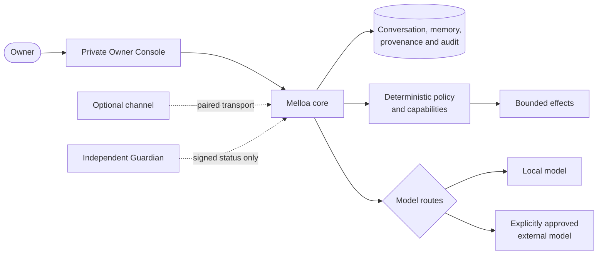

# Melloa

**A private, owner-controlled home for one persistent personal intelligence.**

Melloa keeps conversation, memory, evidence, policy, corrections, and owner control independent from any one model, provider, process, or chat interface. **Melloa** is the system; **Melli** is the personal intelligence whose continuity the system protects.

**Current release:** `v0.2.0 preview` · milestone `M1` · architecture baseline `v0.2`

## Start locally

The default local path is a complete, disposable tour of the Owner Console. It uses a separately built, signed Guardian in offline mode, makes no external model call, and labels its fixed guided output honestly.

You need Linux or macOS, Bash, Python 3.13+, [uv 0.12.0](https://docs.astral.sh/uv/), Node.js 22+, and Go 1.24+:

```bash
git clone https://github.com/melloa-project/melloa.git
git clone https://github.com/melloa-project/melloa-guardian.git
cd melloa
make preview
```

`make preview` installs the locked dependencies, verifies and builds Guardian independently, builds the production Owner Console, creates disposable credentials, and starts both private loopback services. The terminal gives you the exact URL, owner credential, next action, and runtime contract.

In the console:

1. sign in and create a conversation;
2. fill and send the no-network tour message;
3. open **Why this response?** to inspect route, disclosure, evidence, policy, latency, and cost;
4. inspect the timeline and provider state;
5. download and validate an owner export from **Operations**.

Press `Ctrl-C` when you are done. Melloa stops both services and removes the disposable credential and preview state.

To talk to Melli through the reviewed on-device route, install Ollama, pull the exact model, and select it explicitly:

```bash
ollama pull qwen3:4b-instruct-2507-q4_K_M
make preview PREVIEW_MODEL=ollama
```

The dated `qwen3:4b-instruct-2507-q4_K_M` tag avoids moving-alias drift and is suited to bounded structured conversation output. The launcher requires that exact ID to appear in Ollama's loopback OpenAI-compatible model list before it starts Melloa. The terminal then says that owner text and selected memory go to that on-device model, with no external disclosure; the deterministic route remains only as a visibly labelled fallback. This path still uses disposable process-local Melloa state.

The full walkthrough and recovery guidance are in **[Start Melloa locally](docs/getting-started.md)**.

## What the owner can see and control

- **Canonical conversation:** the Owner Console is the primary client; optional channels do not own identity or history.
- **Why a response happened:** route attempts, provider/model identity, selected evidence, policy decisions, external disclosure, latency, token usage, and cost remain inspectable.
- **Memory with provenance:** assertions retain sources, uncertainty, correction history, dispute/retraction state, and content-deletion evidence.
- **Bounded authority:** deterministic policy and capability checks authorize actions; models never receive ambient control.
- **Operational truth:** health, durability, queues, retention, exports, and known recovery boundaries are reported without turning telemetry into audit evidence.
- **Independent restriction and recovery:** Guardian owns signed modes and host authority outside the Melloa runtime.

## How the system fits together



The asymmetry is deliberate: Melloa can verify Guardian status but receives no signing key, transition command, or host-control authority. Models can propose output or actions, but deterministic code owns authorization and side effects.

## Go deeper

- **Use the product:** [start locally](docs/getting-started.md), then [configure model routes and durable state](docs/run-current-mvp.md).
- **Operate it:** [local operations](docs/operations/current-mvp.md) and [recovery](docs/operations/m0-recovery.md).
- **Understand it:** [product vision](docs/01-executive-vision.md), [adopted decisions](docs/23-v0.2-decisions.md), and [chosen architecture](docs/05-chosen-v1-architecture.md).
- **Inspect evidence:** [M0](docs/24-m0-implementation.md), [M1](docs/25-m1-implementation.md), and [threat review](docs/26-m1-threat-review.md).
- **Develop it:** [development and verification](docs/development.md) and [contribution rules](CONTRIBUTING.md).

## Verify a checkout

```bash
make check
make integration
make recovery
```

The last two commands require Docker and use synthetic data. `make recovery` applies every migration, encrypts a PostgreSQL logical snapshot with restic, restores it into a clean database, and proves the recovered conversation, explanation, memory, session/audit, and read-only boundaries through the authenticated owner API. CI runs the same required gates, exercises the authenticated production Owner Console journey, and deploys the validated documentation from `main`.

## Source status

No public source license has been selected. The repository is publicly readable, but reuse, redistribution, and outside contributions require the owner to add explicit license terms.
