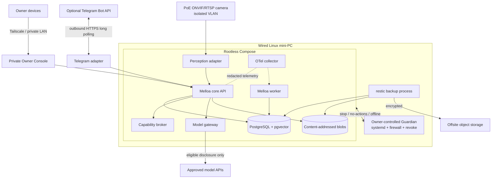
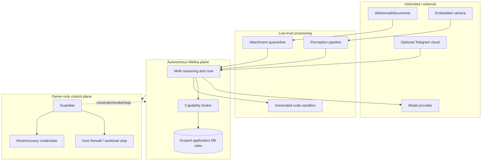
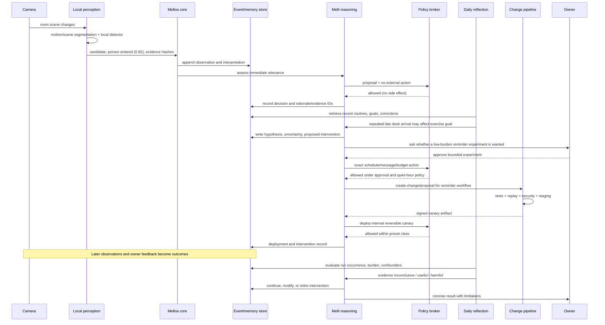

# Final synthesis and decisive recommendation

## Recommendation

If personally responsible for maintaining Melloa for seven years, I would build a **local-first modular monolith centered on PostgreSQL, an append-oriented provenance/audit model, a deterministic capability broker, provider-neutral model adapters, and an independently controlled Guardian**.

Melloa is the system. Melli is one durable personal intelligence whose continuity is represented by identity, memory, goals, relationships, policies, and change history—not by one model, process, or provider. Use temporary specialist workers under a run/proposal boundary. Add another persistent intelligence only when a distinct long-lived identity, responsibility, memory, permission set, or relationship is genuinely required.

The system should be event-oriented without deploying an event-stream platform. PostgreSQL is the V1 source of truth for canonical records, current projections, jobs, outbox, policy state, and audit. `pgvector` is a derived retrieval index. Content-addressed local storage holds frames, clips, exports, and generated artifacts. Rootless Compose keeps operations understandable. An external Guardian, not callable or writable by Melli, owns emergency modes, egress revocation, workload stop, and recovery.

## Answers to the ten final questions

### 1. What architecture would I choose for seven years?

A modular monolith with stable domain/port contracts and explicit trust boundaries:

- PostgreSQL for durable state and asynchronous jobs;
- append-oriented observation → interpretation → assertion/belief → confirmation/correction provenance;
- ordinary relational projections for current state;
- capability adapters behind a deterministic authorization broker;
- model gateway/routing independent of provider and agent framework;
- local-first media/object storage and selective cloud disclosure;
- rootless containers on a wired Linux mini-PC;
- host-owned Guardian and private networking;
- monorepo, ADRs, replay/evals, signed artifact deployment, and tested backups.

This architecture can be split later without paying distributed-systems cost before it produces value.

### 2. What would I build first?

Build the **truth, authority, and recovery spine** before sensing:

1. vocabulary and versioned event/provenance schemas;
2. PostgreSQL/migrations/jobs/outbox/idempotency;
3. owner/Melli identity and correction-aware memory;
4. deterministic capability broker and audit;
5. provider-neutral model gateway with fake model for tests;
6. Guardian modes and credential revocation;
7. encrypted backup/export and clean restore;
8. canonical conversation and the private Owner Console;
9. optional Telegram remote adapter;
10. daily/weekly reflection and intervention records;
11. camera after the truth, authority, recovery, and inspection foundations work.

### 3. What would I explicitly refuse to build yet?

- Kubernetes, service mesh, Kafka/Redpanda, graph database, standalone vector database;
- permanent multi-agent society;
- public domain/webhook/cloud control plane;
- continuous cloud video or general surveillance;
- autonomous IAM, finance, governance, or irreversible infrastructure;
- full local-GPU stack before profiling;
- OpenBao/SPIFFE/microVM fleet before dynamic multi-node need;
- native mobile/voice experience before channel and privacy contracts stabilize;
- an integration marketplace or nontechnical onboarding.

### 4. Which three architectural choices matter most today?

1. **Epistemic provenance:** observation is not interpretation, interpretation is not belief, and belief is not user-confirmed fact. Corrections append and propagate.
2. **Authority outside the model:** every side effect uses deterministic capability authorization and scoped credentials; Guardian remains independent.
3. **Replaceable intelligence and integrations:** provider/framework/channel/camera details sit behind versioned contracts and canonical owner-controlled data.

PostgreSQL versus another competent database is less important than these boundaries.

### 5. What mistakes are most likely to kill the project?

- building the seven-year distributed platform before proving one useful loop;
- allowing plausible inferences to accumulate as facts;
- giving model-facing processes broad credentials or host control;
- measuring activity instead of owner outcomes;
- adding integrations without deletion, security, failure, and evaluation paths;
- notification fatigue and creepy proactivity;
- unlimited multimodal/coding loops and opaque cost;
- never proving restoration;
- framework lock-in and repository sprawl;
- treating voice/UI spectacle as the product.

### 6. What is genuinely difficult?

- maintaining truthful, correctable long-term memory under uncertainty and schema evolution;
- granting useful autonomy without turning untrusted content into authority;
- measuring whether an intervention caused meaningful benefit rather than correlation or compliance theatre;
- safely evaluating and deploying self-created software;
- preserving owner trust across inevitable model and sensor mistakes;
- governing years of sensitive personal and third-party data;
- keeping one engineer able to operate the system as capabilities accumulate.

### 7. What sounds difficult but is mostly solved?

- containerized service deployment on one host;
- relational durable state, migrations, queues/outbox patterns, private networking, encrypted backups;
- Git branches/PRs/CI/artifact signing;
- Telegram bot transport and RTSP/ONVIF camera acquisition;
- structured telemetry and basic model-provider adapters;
- content-addressed files and open export formats.

The work is integrating these primitives under coherent truth, authority, and evaluation semantics—not inventing replacements.

### 8. Which assumptions did research prove wrong or weaken?

- Raspberry Pi should be an edge option, not the blessed core server.
- Telegram is a useful replaceable channel, not an end-to-end encrypted permanent UI or root-control path.
- An event-oriented core does not require Kafka/NATS/Temporal in V1.
- Multiple persistent agents are not inherently better than one durable intelligence plus temporary specialists.
- A vector database is retrieval infrastructure, not memory architecture.
- Local-first is not local-only; weak local reasoning can be less safe/useful than controlled cloud escalation.
- Code generation is easier than authorization, evaluation, rollback, and benefit measurement.
- Camera-first would optimize the visible demo before trust foundations.
- A public domain is unnecessary for the private Owner Console or optional Telegram long polling.

### 9. What is the approximate first-year cost?

For a disciplined V1:

- hardware: roughly **£510–£1,200**;
- operation: roughly **£15–£70/month** for one camera, local filtering, offsite backup, electricity, Telegram, and modest model use;
- practical first-year total: approximately **£800–£2,100**, excluding developer labour.

Heavy frontier reasoning, cloud multimodal video, autonomous coding/eval loops, or premature GPU hardware can push this into hundreds or thousands of pounds per month. Prices are dated planning estimates and require purchase-time verification.

### 10. What should days 30, 90, and 365 look like?

**Day 30:** reproducible host, Postgres, schemas/provenance, canonical conversation, private Owner Console, policy broker, model gateway, audit/cost, Guardian, backup restored once, and optional Telegram pairing. Conversation, inspection, and corrections only.

**Day 90:** daily/weekly reflection, replay/eval suite, explicit goal/hypothesis/intervention workflow, calibrated proactivity, one reversible evaluated intervention, camera added only if the foundations remain reliable.

**Day 365:** months of trustworthy history and cost/outcome evidence, controlled low-risk software creation with staging/canary/rollback, a small number of valuable capabilities, repeated recovery/security drills, architecture thresholds reassessed, and public release only if onboarding and operations are reproducible.

## The recommended V1

### Exact major components

| Concern | V1 choice |
|---|---|
| Host | dedicated wired x86-64 mini-PC; 16–32 GB RAM; 1 TB NVMe; Debian/Ubuntu LTS |
| Runtime | rootless Docker Engine + Docker Compose; systemd-owned Guardian; Ansible host bootstrap |
| Core languages | Python 3.13+, SQL, and TypeScript for the private Owner Console |
| Core/API | modular monolith; FastAPI/Pydantic-compatible typed boundaries |
| Database | PostgreSQL 18 with separate roles and migrations |
| Semantic index | `pgvector`, rebuildable from canonical memory records |
| Async work | PostgreSQL job/outbox tables; durable polling plus `LISTEN/NOTIFY` wake-up hint |
| Blobs | content-addressed local filesystem with metadata/retention in Postgres |
| Primary client | private authenticated Owner Console over LAN/Tailscale |
| Conversation | canonical channel-independent threads/messages/turns with provenance |
| Secondary channel | optional Telegram Bot API long polling; one paired/whitelisted owner ID |
| Camera | wired PoE ONVIF Profile T/RTSP camera on isolated VLAN |
| Perception | Frigate + go2rtc or thin compatible adapter; cheap local segmentation/detection; selective evidence |
| Models | task/sensitivity-aware gateway; at least one hosted provider; optional local llama.cpp/MLX/vLLM endpoint |
| Policy | typed deterministic broker; deny/allow/approval decision; exact action hash; capability grants/budgets |
| Secrets | SOPS + age/OS keyring bootstrap; scoped credential broker; provider-side budgets |
| Private access | Tailscale default with WireGuard-compatible escape; no public application ingress |
| Generated code | deferred until gVisor-grade sandbox, replay/CI, signed artifacts, canary, rollback exist |
| Telemetry | append-oriented domain/audit records + OpenTelemetry traces/metrics/logs, redacted |
| Backups | encrypted restic to local USB and B2/equivalent; monthly clean restore |
| Docs | MkDocs Material, Mermaid, ADRs, runbooks, versioned source register |
| Git | monorepo + separately protected Guardian trust domain; protected main/CODEOWNERS/pinned CI |

### V1 service boundaries

```text
Melloa Core
  identity and Melli continuity
  canonical conversation
  event/provenance/memory
  goals, hypotheses, interventions
  model gateway and retrieval
  policy requests and audit

Owner Console
  first-party conversation
  timeline, provenance and corrections
  run, media, cost, disclosure and health views

Melloa Worker
  durable jobs
  interpretation/indexing
  reflection/evaluation
  retention/export

Capability Broker
  grants, policy, approvals
  credential lease
  side-effect receipt

Adapters
  optional Telegram
  perception/camera
  model providers
  files/backups

Guardian (outside autonomous plane)
  modes, stop, egress revoke
  credential removal
  recovery/read-only control
```

## V1 deployment diagram



## V1 data-flow diagram

```mermaid
flowchart LR
  Source[Source or sensor] --> Raw[Raw evidence / inbound observation]
  Raw --> Validate[Validate, classify, hash, taint]
  Validate --> Candidate[Candidate event]
  Candidate --> Interpret[Semantic interpretation]
  Interpret --> Assertion[Assertion or hypothesis\nwith confidence + evidence]
  Assertion --> Memory[Memory projections and indexes]
  Memory --> Reason[Goal/context reasoning]
  Reason --> Proposal[Action proposal]
  Proposal --> Policy[Deterministic policy + capability broker]
  Policy -->|deny| Audit[Audit outcome]
  Policy -->|approval| Human[Exact owner approval]
  Human --> Policy
  Policy -->|allow| Action[Scoped capability execution]
  Action --> Outcome[Observed result/outcome]
  Outcome --> Evaluate[Evaluate usefulness and side effects]
  Evaluate --> Memory
  Evaluate --> Change[Keep, alter, stop, or propose software change]
```



## V1 trust-boundary diagram



## Realistic V1 sequence



The candidate “person entered” remains a probabilistic interpretation. A later routine conclusion does not become a fact merely because it is repeated. The intervention requires an explicit hypothesis, bounded authority, a burden budget, and outcome review.

## First implementation milestones

### M0 — contracts and recovery

Deliver event envelope, assertion/provenance model, owner/Melli identity, policy request/decision schema, Postgres migrations, audit, Guardian modes, CI, encrypted backup and successful restore.

### M1 — trustworthy conversation and owner inspection

Deliver canonical conversation, the private Owner Console, provider-neutral model gateway, cited retrieval, correction/supersession, structured decision/run inspection, health/media/cost/disclosure views, optional Telegram long polling/pairing, and degraded behavior during provider/channel failure.

### M2 — reflective closed loop

Deliver goals/hypotheses/interventions/outcomes, daily and weekly loops with no-op/budgets, replay/evals, and one reversible measured intervention.

### M3 — selective vision

Deliver isolated PoE camera, local candidate segmentation/detection, evidence/probabilistic events, calibration, retention, and sensitivity-aware cloud escalation.

### M4 — controlled creation

Deliver isolated generated-code runner, PR/CI/replay/security gates, signed staging artifact, low-risk canary, rollback, and benefit/expiry review.

A milestone is incomplete without documentation, threat review, observability, retention/export, tests, and runbook.

## Final architectural stance

Melloa should be ambitious about the **loop** and conservative about **authority**. It should accumulate evidence, not mythology; create reversible experiments, not permanent clutter; and let intelligence improve without allowing a model update, framework, agent process, or provider to redefine who Melli is.

The foundation to protect is not a particular application. It is the owner-controlled mechanism by which observations become qualified beliefs, goals become bounded actions, consequences become evidence, and the system can safely change its own tools while remaining understandable and stoppable.
