# Architecture diagrams

These diagrams are design artifacts, not decorative overview pictures. They show data, authority, trust, lifecycle, and migration boundaries. Mermaid source is kept in version control.

## 1. Top-level system architecture

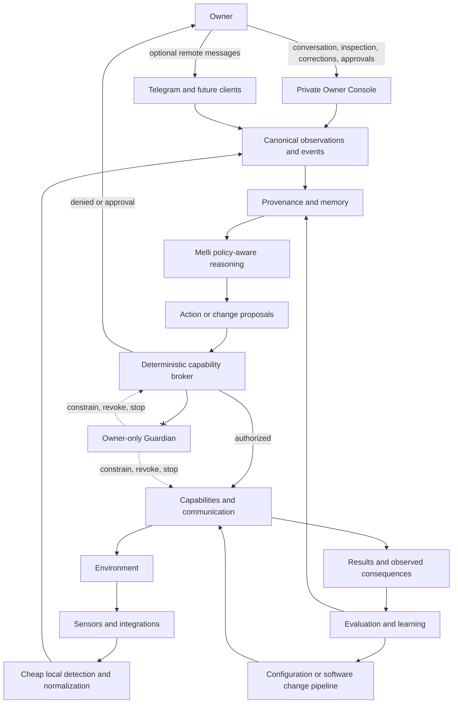

## 2. Trust boundaries

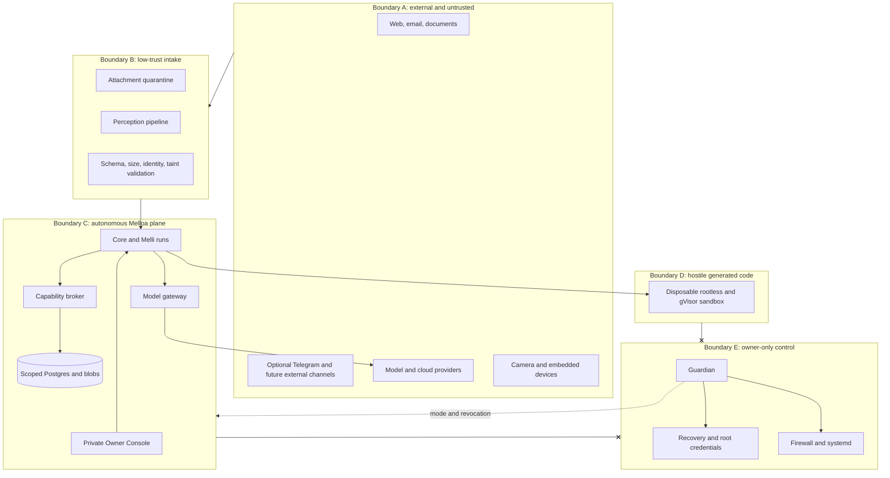

## 3. Control plane versus autonomous plane

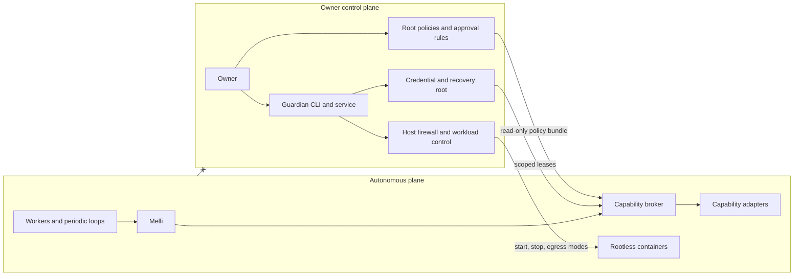

## 4. Event ingestion flow

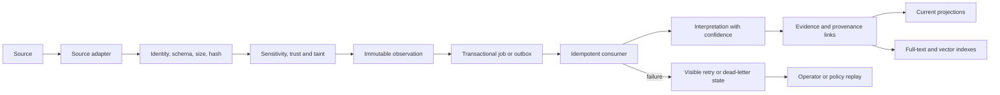

## 5. Camera perception pipeline

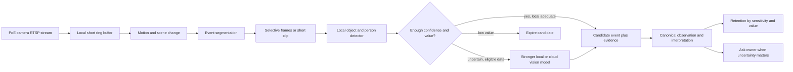

## 6. Model-routing architecture

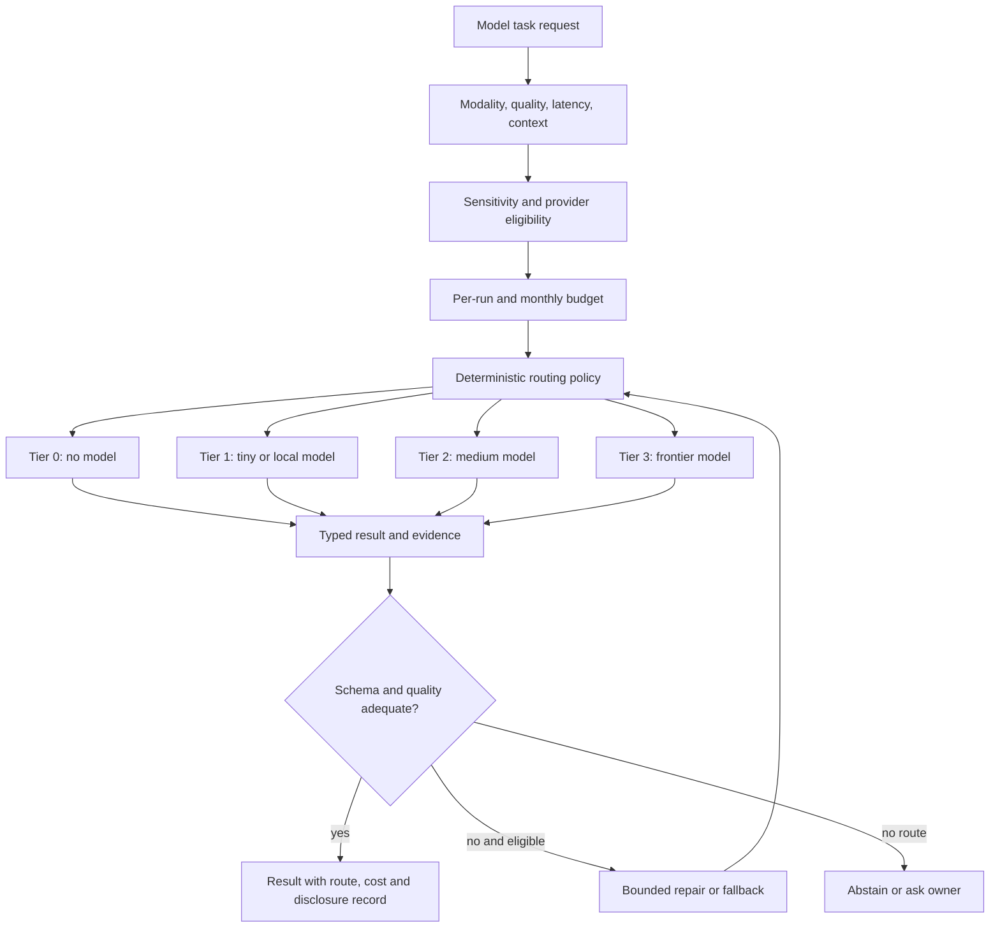

## 7. Memory layers

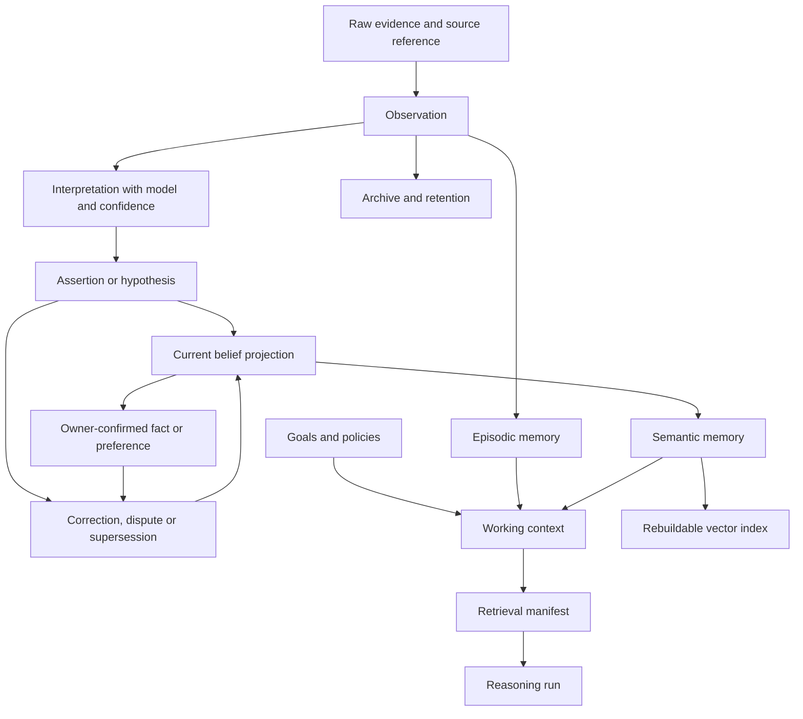

## 8. Autonomous software-development loop

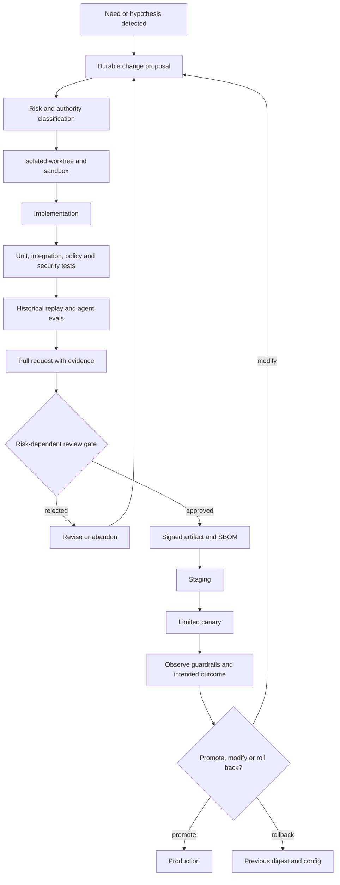

## 9. V1 deployment architecture

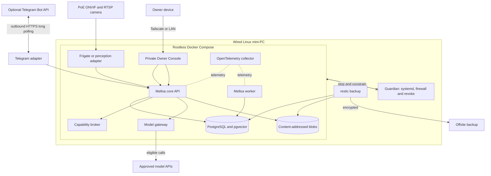

## 10. Credential flow

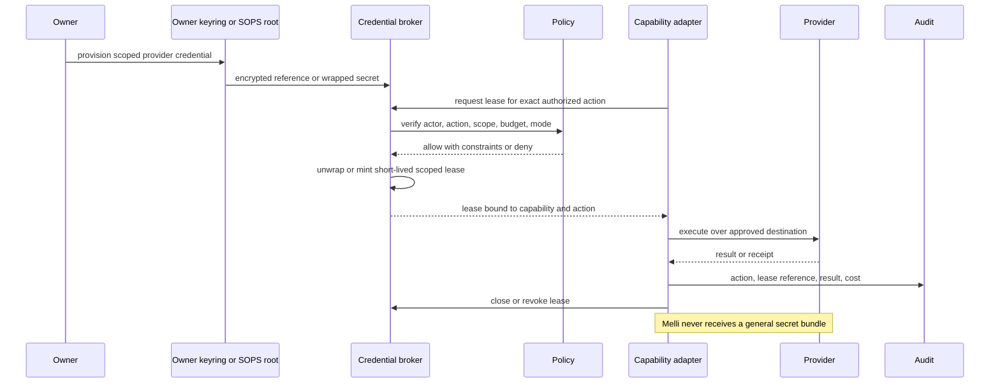

## 11. Kill-switch architecture

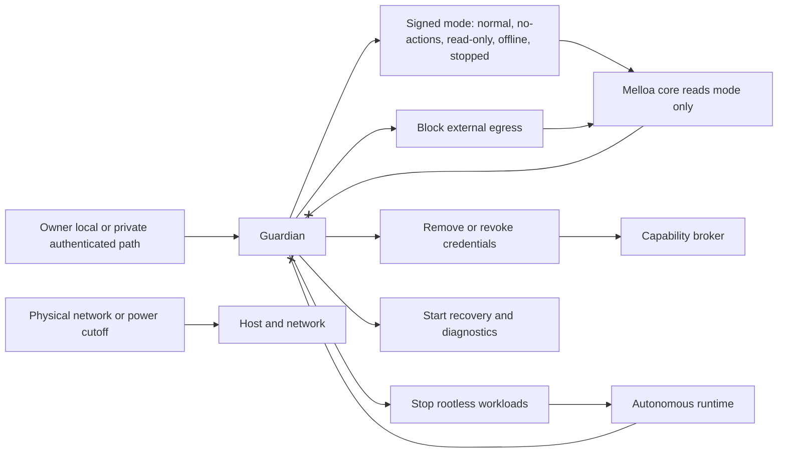

## 12. Permission and capability architecture

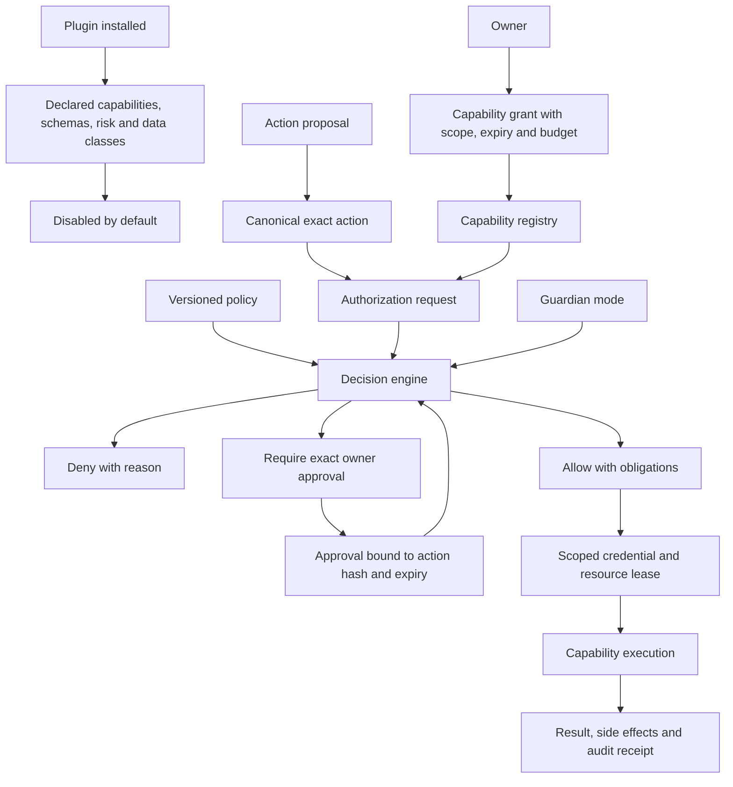

## 13. Goal hierarchy

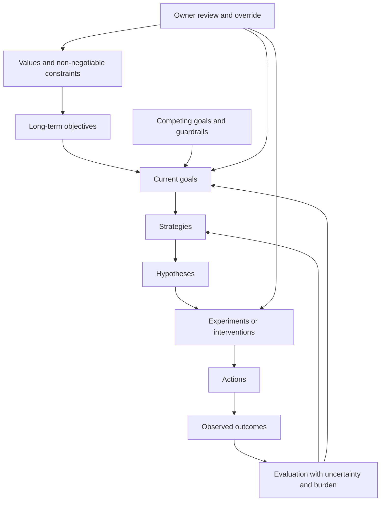

## 14. Periodic reasoning loops

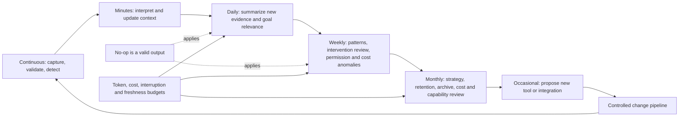

## 15. Data lifecycle

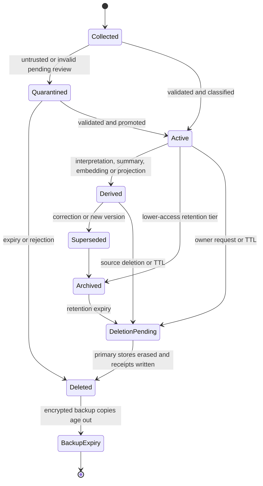

## 16. Plugin and module interface

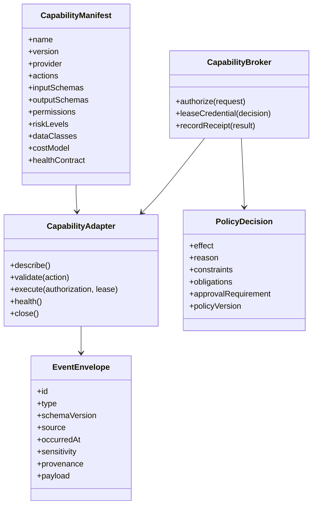

## 17. Network topology

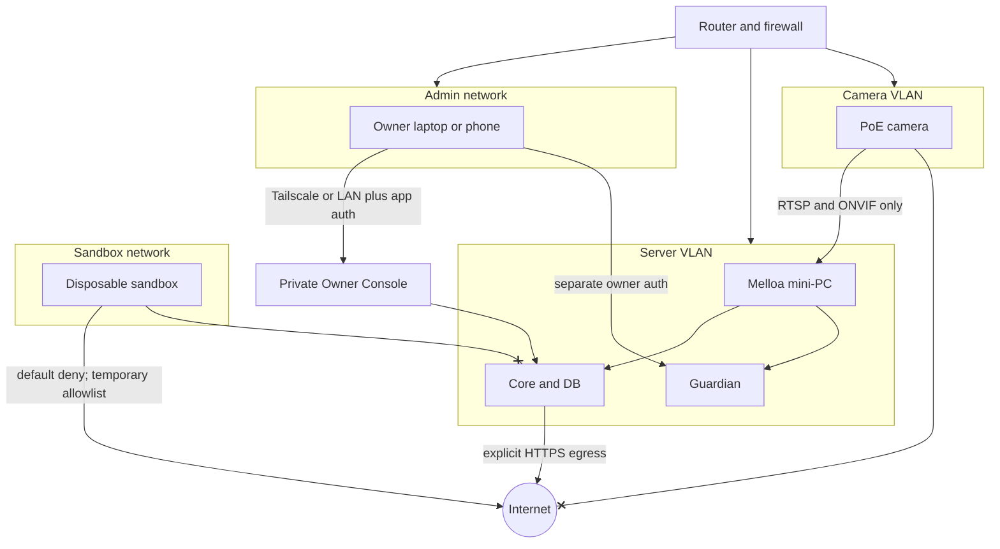

## 18. CI and CD flow

```mermaid
flowchart LR
  Branch[Agent or human branch] --> Static[Format, type, lint, secret scan]
  Static --> Unit[Unit and property tests]
  Unit --> Contract[Schema and migration compatibility]
  Contract --> Security[Dependency, license and security checks]
  Security --> Replay[Replay and model evals]
  Replay --> PR[Evidence-rich pull request]
  PR --> Review{CODEOWNERS and risk gate}
  Review -->|reject| Branch
  Review -->|approve| Build[Build pinned image]
  Build --> SBOM[SBOM, provenance and signature]
  SBOM --> Stage[Staging on scrubbed or replay data]
  Stage --> Canary[Bounded canary]
  Canary --> Metrics[Guardrails, costs and outcomes]
  Metrics -->|pass| Promote[Promote exact digest]
  Metrics -->|fail| Rollback[Automatic or owner rollback]
```

## 19. Threat model

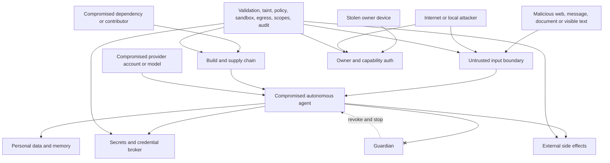

## 20. Onboarding flow

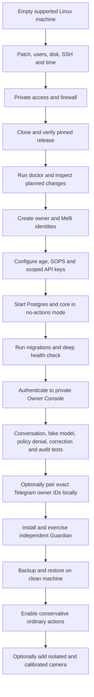

## 21. Realistic room-event to intervention sequence

```mermaid
sequenceDiagram
  participant Cam as Camera
  participant P as Perception
  participant Core as Core
  participant DB as Event and memory store
  participant Melli
  participant Policy
  participant Owner
  participant Change as Change pipeline

  Cam->>P: scene changes
  P->>P: segment and run local detector
  P->>Core: person entered candidate, confidence and evidence hashes
  Core->>DB: append observation and interpretation
  Core->>Melli: assess immediate relevance
  Melli->>Policy: no external action proposal
  Policy-->>Melli: allowed
  Melli->>DB: record decision and evidence IDs

  Note over DB,Melli: Daily reflection later
  Melli->>DB: retrieve recent routine events and corrections
  Melli->>DB: write uncertain pattern hypothesis
  Melli->>Owner: propose bounded reminder experiment
  Owner-->>Melli: approve exact experiment
  Melli->>Policy: request schedule and owner-only message capability
  Policy-->>Melli: allow with budget and expiry
  Melli->>Change: implement and test low-risk workflow
  Change-->>Melli: signed canary artifact
  Melli->>Policy: deploy canary request
  Policy-->>Melli: allow reversible internal class
  Melli->>DB: intervention and deployment records
  Note over Cam,DB: Outcomes arrive over subsequent days
  Melli->>DB: evaluate observed behavior, owner feedback and confounders
  Melli->>Owner: report useful, harmful or inconclusive result
```

## 22. Provenance entity relationships

```mermaid
erDiagram
  SOURCE ||--o{ OBSERVATION : emits
  OBSERVATION ||--o{ EVIDENCE_LINK : has
  BLOB ||--o{ EVIDENCE_LINK : referenced_by
  OBSERVATION ||--o{ INTERPRETATION : interpreted_as
  MODEL_RUN ||--o{ INTERPRETATION : produced
  INTERPRETATION ||--o{ ASSERTION : supports
  ASSERTION ||--o{ ASSERTION_EVIDENCE : justified_by
  OBSERVATION ||--o{ ASSERTION_EVIDENCE : evidence_for
  ASSERTION ||--o{ ASSERTION_RELATION : supersedes_or_disputes
  ASSERTION ||--o{ BELIEF_PROJECTION : projects
  OWNER_CONFIRMATION ||--o{ ASSERTION : confirms_or_corrects
  GOAL ||--o{ HYPOTHESIS : motivates
  HYPOTHESIS ||--o{ INTERVENTION : tested_by
  INTERVENTION ||--o{ ACTION : contains
  ACTION ||--|| POLICY_DECISION : authorized_by
  ACTION ||--o{ OUTCOME : produces
  OUTCOME ||--o{ EVALUATION : assessed_by
  CHANGE_PROPOSAL ||--o{ DEPLOYMENT : becomes
  DEPLOYMENT ||--o{ OUTCOME : observed_through
```

## 23. Guardian state machine

```mermaid
stateDiagram-v2
  [*] --> Stopped
  Stopped --> Offline: owner starts local-only services
  Offline --> ReadOnly: permit reads and local analysis
  ReadOnly --> NoActions: permit state updates but no side effects
  NoActions --> Normal: owner enables policy-bounded actions
  Normal --> NoActions: suspicious action or owner pause
  Normal --> Offline: provider or network incident
  Normal --> Stopped: emergency stop
  NoActions --> ReadOnly: integrity or migration incident
  Offline --> Stopped: host or credential incident
  ReadOnly --> Stopped: recovery escalation
  Stopped --> Recovery: owner enters isolated diagnostics
  Recovery --> Stopped: repair complete, restart requires explicit transition
  note right of Normal
    Melli cannot change Guardian state.
    Core consumes signed/read-only mode.
  end note
```

## 24. Replay and simulation architecture

```mermaid
flowchart LR
  Snapshot[Historical state snapshot] --> Engine[Replay engine]
  Events[Versioned event stream] --> Engine
  Clock[Virtual clock] --> Engine
  Policy[Policy version under test] --> Engine
  Route[Model or prompt under test] --> Engine
  FakeCaps[Simulated capability receipts] --> Engine
  Engine --> Runs[Candidate runs with side effects disabled]
  Runs --> Compare[Compare decisions, calls, cost, latency and privacy]
  Baseline[Baseline expectations and distributions] --> Compare
  Compare --> Gate{Release thresholds}
  Gate -->|pass| Evidence[Attach evidence to change proposal]
  Gate -->|fail| Diagnose[Failure clusters and regression cases]
  Diagnose --> Route
```

## 25. Identity continuity and worker lifecycle

```mermaid
flowchart TB
  Melloa[Melloa runtime and deployment] --> Registry[Persistent intelligence registry]
  Registry --> Melli[Melli identity]
  Melli --> Memory[Long-term memory and relationships]
  Melli --> Goals[Goals, values and policies]
  Melli --> History[Change and interaction history]
  Melli --> Session[Reasoning run]
  Session --> ModelA[Foundation model A]
  Session --> ModelB[Foundation model B]
  Session --> Worker[Ephemeral specialist worker]
  Worker --> Tools[Scoped tools and context]
  Worker --> Result[Result and evidence]
  Result --> Session
  ModelA -. replaceable .-> Session
  ModelB -. replaceable .-> Session
  Session -. terminates .-> Melli
  note right of Melli
    Identity does not equal model,
    process, session or provider.
  end note
```

## 26. Schema evolution and replay

```mermaid
flowchart TB
  V1[Event schema v1] --> Envelope[Stable envelope and immutable payload version]
  V2[Event schema v2] --> Envelope
  Envelope --> Store[(Canonical store)]
  Store --> Reader1[v1 reader or adapter]
  Store --> Reader2[v2 reader]
  V1 --> Upcast[Explicit v1 to v2 upcaster]
  Upcast --> Reader2
  Store --> Replay[Replay harness]
  Replay --> Projection[Rebuild current projection and indexes]
  Projection --> Verify[Compatibility and semantic invariant checks]
  Verify --> Deploy[Deploy new readers]
  Deploy --> Contract[Later contract or retire old field]
  Raw[Preserved source evidence where justified] --> Replay
```

## Diagram maintenance rules

- Update a diagram in the same pull request as the boundary it documents.
- Use direction and labels to show authority, not only connectivity.
- Mark forbidden paths and external trust explicitly.
- Do not show a future component as if it exists in V1.
- Keep canonical component names consistent with the conceptual model.
- Render diagrams in CI or at least parse-check Mermaid fences before release.
