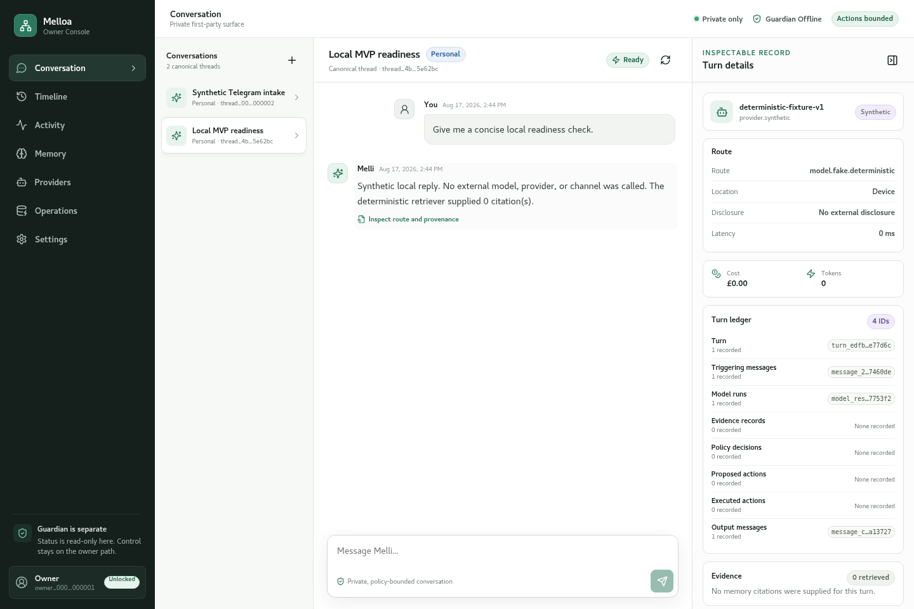
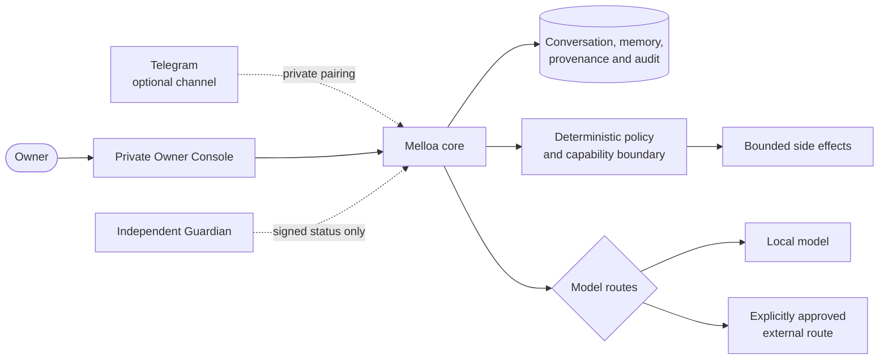
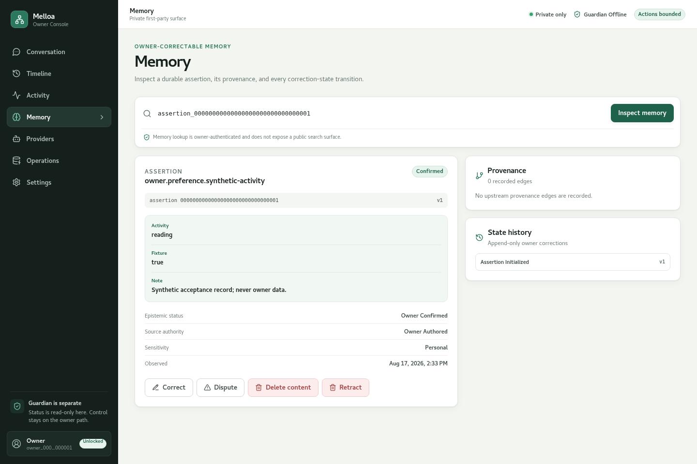
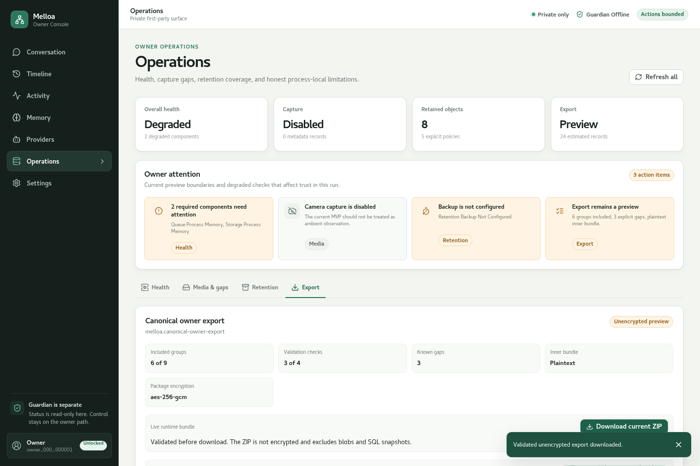
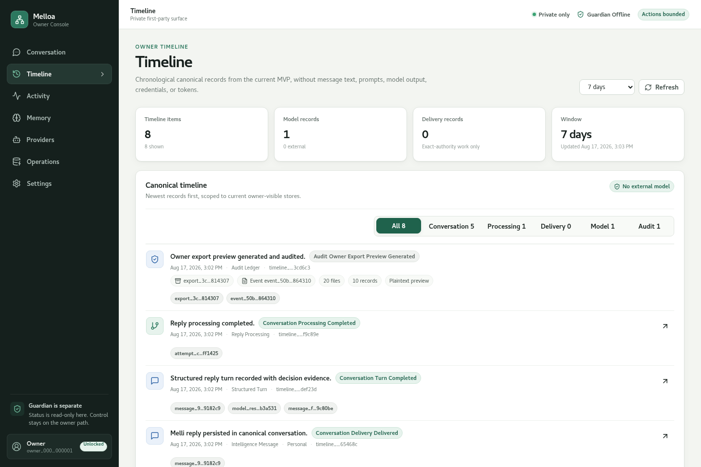

---
hide:
  - toc
---

# Melloa

**A local-first home for one personal intelligence—built to keep identity, memory, evidence, policy, and owner control durable while models, providers, processes, and interfaces change.**

**Melloa** is the system. **Melli** is the persistent personal intelligence that lives through it. A model call is temporary; the owner's relationship, canonical conversation, memory, provenance, policies, and corrections are not.

[Start Melloa locally](getting-started.md){ .md-button .md-button--primary }
[See what works today](25-m1-implementation.md){ .md-button }

[](assets/current-mvp/conversation-desktop.png)

*The current private Owner Console: canonical conversation on the left, route, disclosure, provenance, cost, and policy evidence on the right. The pictured route is the clearly labelled no-network synthetic fallback.*

The fastest path is a private, no-network owner journey with explicit boundaries: signed Guardian status, process-local disposable state, and a fixed response labelled as a fixture rather than Melli. It reaches conversation, explanation, inspection, export, and clean shutdown without Docker, provider credentials, or personal data. With Ollama and the dated `qwen3:4b-instruct-2507-q4_K_M` model installed, one explicit selector turns the same journey into a real on-device conversation with Melli.

## What you can do now

- Take an authenticated no-network tour of the canonical conversation immediately, then talk to Melli after configuring an eligible model route; neither path is owned by a model provider or chat client.
- Inspect which model route ran, what memory evidence was selected, whether anything left the machine, and what it cost.
- Review, correct, dispute, retract, or content-delete memory while preserving provenance and deletion evidence.
- Inspect provider health, delivery attempts, retention coverage, operational status, and a content-free owner timeline.
- Download and validate a canonical owner-data export, with an optional encrypted package wrapper.
- Prove complete PostgreSQL owner-state recovery through an encrypted restic snapshot, clean database restore, and authenticated post-restore traversal.
- Keep the independent Guardian in signed `offline`, `read-only`, `no-actions`, `normal`, `stopped`, or `recovery` modes without giving Melloa its signing key or transition authority.

The local run needs the two public sibling repositories, Python, uv, Node.js, and Go. It needs no Docker daemon, model key, Telegram account, camera, or private deployment repository.

```bash
git clone https://github.com/melloa-project/melloa.git
git clone https://github.com/melloa-project/melloa-guardian.git
cd melloa
make preview
```

The command prints the Owner Console URL, disposable credential, first action, runtime contract, and cleanup behavior. Follow [Start Melloa locally](getting-started.md) for the complete owner walkthrough.

```bash
ollama pull qwen3:4b-instruct-2507-q4_K_M
make preview PREVIEW_MODEL=ollama
```

That second path requires the exact model before startup, makes no external-provider disclosure, and keeps the labelled deterministic fallback visible. The checked-in visual references continue to show the no-network fixture; test-only protocol responses are never used as product screenshots.

## How the pieces fit together



The asymmetry is deliberate: Melloa may read the Guardian's signed projection, but it receives no Guardian private key, transition command, signing API, or host-control authority. Models produce candidate responses or plans; deterministic code owns authorization and exact side-effect boundaries.

## See the product

### Inspect and correct memory

[](assets/current-mvp/memory-desktop.png)

Memory is owner-scoped and provenance-rich. The preview exposes values, sources, status history, corrections, contestation, retraction, and content-deletion evidence rather than presenting an opaque vector store as “memory.”

### Understand operations and export limits

[](assets/current-mvp/operations-export-desktop.png)

Operational views show what is healthy, durable, exportable, encrypted, or still missing. Current export is a validated portability preview, while `make recovery` separately proves the complete PostgreSQL logical-backup and clean-restore mechanism. Neither claims that a particular installation has a recent offsite backup.

### Follow a content-free evidence timeline

[](assets/current-mvp/timeline-desktop.png)

The timeline joins current-MVP conversation, processing, model, delivery, and owner-export evidence without copying message text, prompts, credentials, destinations, or raw audit payloads into the activity feed.

More desktop and mobile reference states are linked from [Expected visual states](run-current-mvp.md#expected-visual-states).

## Why build it this way

- **Persistence over provider lock-in:** Melli is not a model, prompt, process, or subscription. Durable identity and history stay in owner-controlled contracts.
- **Evidence over mystique:** important interpretations, memories, disclosures, decisions, actions, and corrections carry inspectable provenance.
- **Explicit authority over ambient agency:** models do not receive general tool, credential, policy, or Guardian authority.
- **Local-first, not local-only:** the default is private and no-network; an owner may configure bounded external routes with visible disclosure.
- **Honest operational boundaries:** restart durability, export validation, telemetry, backup, and production readiness are named separately.

## Learn at your own depth

1. **Use it:** [Start Melloa locally](getting-started.md).
2. **Understand the product:** [Executive vision](01-executive-vision.md), [design principles](02-design-principles-requirements.md), and [conceptual model](03-conceptual-model.md).
3. **Understand the boundaries:** [v0.2 decisions](23-v0.2-decisions.md), [chosen V1 architecture](05-chosen-v1-architecture.md), and [M1 threat review](26-m1-threat-review.md).
4. **See the system visually:** [Architecture diagram catalogue](diagrams.md).
5. **Inspect implementation evidence:** [M0](24-m0-implementation.md), [M1](25-m1-implementation.md), [observability and operational evidence](27-m1-observability-operational-evidence.md), and the [current validation report](https://github.com/melloa-project/melloa/blob/main/VALIDATION.md).
6. **Add integrations:** [Configure advanced local routes and durable state](run-current-mvp.md).
7. **Work on the project:** [Development and verification](development.md) and the [pre-release compatibility process](compatibility.md).

The deeper research remains available, but it is no longer the front door. Start with the product, then follow the layer of detail you need.
